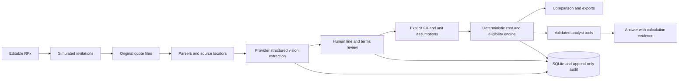

# QuoteIQ — Kill the Quote Spreadsheet

A procurement RFx workspace that connects RFx drafting, supplier invitations, multimodal quote extraction, human review, normalization, comparison and a grounded analyst in one workflow.

**Live demo:** <https://quoteiq-aerchain.streamlit.app/>

## Product workflow

- Generate and edit an RFx with line items, terms and quality requirements.
- Register suppliers and simulate invitations.
- Extract XLSX, PDF, DOCX, image and pasted-email quotations through the same AI pipeline.
- Review raw values, corrections, commercial terms and quality responses with source evidence.
- Normalize only supported currencies and units, then compare complete and eligible bids.
- Ask natural-language questions backed by validated operations and deterministic calculations.
- Export comparison evidence, original sources and an append-only audit trail.

See the [Streamlit Community Cloud deployment guide](docs/DEPLOY_STREAMLIT_CLOUD.md) for hosting instructions.

## Run locally

Python **3.12** is required. From the project directory:

```powershell
python -m venv .venv
.venv\Scripts\python -m pip install -r requirements-lock.txt
Copy-Item .env.example .env
# Edit .env locally: set AI_PROVIDER and that provider's key. Never commit credentials.
.venv\Scripts\python -m streamlit run streamlit_app.py
```

Linux/macOS:

```bash
python3.12 -m venv .venv
.venv/bin/python -m pip install -r requirements-lock.txt
cp .env.example .env
# Set AI_PROVIDER and that provider's key in .env.
.venv/bin/python -m streamlit run streamlit_app.py
```

Open **http://localhost:8501**. On this Windows workspace a Python 3.12 runtime and `.venv` were installed locally; `powershell -File scripts/run.ps1` starts that environment. `requirements.txt` declares supported direct dependency ranges; `requirements-lock.txt` records the validated resolved environment.

### AI Provider Setup

Choose **one** of the following:

#### Gemini (Free tier recommended)
1. Go to [ai.google.dev](https://ai.google.dev) and click **Get started for free**
2. Create a Google account or sign in
3. Click **Get API key** at [ai.google.dev/apikey](https://ai.google.dev/apikey)
4. Copy the key and set in `.env`:
   ```
   AI_PROVIDER=gemini
   GEMINI_API_KEY=<your-key>
   GEMINI_MODEL=gemini-3.5-flash-lite
   ```
5. Free tier offers generous limits for development; see [pricing](https://ai.google.dev/pricing)

#### OpenAI
1. Create an account at [platform.openai.com](https://platform.openai.com)
2. Add billing and generate an API key at [platform.openai.com/api-keys](https://platform.openai.com/api-keys)
3. Set in `.env`:
   ```
   OPENAI_API_KEY=<your-key>
   OPENAI_MODEL=gpt-4.1
   ```

Environment settings:

| Variable | Purpose |
| --- | --- |
| `AI_PROVIDER` | Explicitly selects `gemini` or `openai`; required when both keys exist. |
| `GEMINI_API_KEY` | Server-side Gemini credential for free-tier AI operations. |
| `GEMINI_MODEL` | Default `gemini-3.5-flash-lite`, selected for reliable free-tier multimodal structured extraction. |
| `OPENAI_API_KEY` | Server-side OpenAI credential. Requires paid account with API credits. |
| `OPENAI_MODEL` | Default `gpt-4.1`; use an account-accessible model supporting vision, Responses, structured outputs and function calls. |
| `QUOTEIQ_DATA_DIR` | SQLite, original sources and generated demo files; default `data`. Use a persistent writable directory. |
| `PORT` | Docker deployment HTTP port; default 8501. |

No key means no AI-generated RFx, extracted supplier answers or natural-language analyst results. You can create the clearly labelled fictional RFx seed, generate/download original documents, edit RFx/suppliers and inspect empty comparisons. Uploads without a key retain originals and parser evidence and report failure honestly. There is no mock extraction or offline answer fallback.

## Walk through the complete demo

QuoteIQ has two isolated experiences. **Guided demo** uses the five-supplier assignment dataset and presentation shortcuts. **Full workspace** stores data in a separate SQLite workspace and permits a variable number of RFx rows and suppliers. Switching experiences does not mix quotations, reviews or audit records.

After extracting the five guided-demo sources, use **Review desk → Presentation fast track**. One explicit buyer confirmation saves every complete extracted value that was checked against its preserved original, then lists only missing or ambiguous line exceptions for individual correction. It never generates replacement prices, matches or commercial facts.

1. **Overview → Prepare demo workspace** creates a reproducible 30-item fictional seed RFx and five original supplier documents. Alternatively use **RFx studio → Generate 30-item RFx with AI**, edit it and then generate source files for that RFx in Quote inbox. AI output is labelled separately from the offline seed.
2. **RFx studio:** edit all 30 quantities/specifications, commercial terms, lead-time policy and mandatory quality questions. Export the request workbook.
3. **Suppliers:** edit five fictional suppliers, preview the RFx invitation and simulate an invitation round. All invitation events are persisted; no email is sent.
4. **Quote inbox → Extract all five with AI:** each generated file enters the exact same `ingest()` route used for uploads and pasted email. Calls may take several minutes and consume provider quota. There is no hidden answer JSON. A successful newer quote replaces that supplier's active revision; a failed attempt does not replace a working quote.
5. **Review desk:** inspect the original, page/cell/paragraph evidence and immutable extraction. Enter a documented FX rate for USD and an explicit box-to-piece assumption. No rate is supplied by the application. For a repeatable fictional scenario you may enter `USD → INR 85` with an as-of date and source `Buyer-approved fictional scenario, not a market rate`.
6. Edit interpreted line values as necessary. Set each checked line to **approved** or **rejected**, tick its **Save** box, give a reason and save. For complete exact matches with no issues, use **Review complete lines together** after explicitly confirming you verified every listed candidate. Ambiguous lines stay in individual review. Rejected duplicates are excluded; incomplete lines cannot be approved with fabricated defaults.
7. Under **Commercial & quality**, verify freight, tax basis, lead time, answers and every condition. Deccan's 3% discount needs either confirmed satisfaction of all conditions or an explicit decision to ignore it. Unknown fields remain unresolved even after review. Approve the commercial review with a reason.
8. **Compare & decide:** inspect the 30 × 5 matrix, complete pre-tax delivered totals, mandatory quality eligibility, cheapest eligible material price for each item, source references and blockers. GreenFold's long lead time and uncertain quality response, and MetroBox's missing lines/freight/terms, are deliberate demo problems. Resolve them only from additional evidence; do not fabricate approvals.
9. **AI analyst:** ask which complete bid is cheapest, why a supplier is ineligible, or compare an item's prices and sources. Every successful response carries tool evidence, scope, formulas, tables and export; supplier-total evidence also supports a chart.
10. Export the comparison workbook and complete evidence bundle. **Audit trail** shows raw extraction, normalized snapshots, original/revised values, actors, reasons, timestamps and analyst tool evidence.

Editing an RFx invalidates earlier quotes for the current comparison. Their sources and audit history stay available; re-upload or re-extract against the new request. Use Review desk to select another extracted revision of a supplier quote for the same RFx.

## Demo documents

| Supplier | Original file | Deliberate complication |
| --- | --- | --- |
| KraftNest Packaging | Nonstandard `.xlsx` | Header starts at B6, alternate labels, prices per 100 pieces, separate terms sheet |
| Deccan Corrupack | `.pdf` | 3% merchandise discount only for all 30 SKUs, subtotal over INR 400,000 and 20% advance within seven days |
| BlueHarbor Cartons | Prose-heavy `.docx` | USD quote, four-decimal rates, whole-order freight in USD, no implicit FX |
| GreenFold Industries | `.jpg` | Synthetic phone-photo effect: tilt, blur, compression and a smudged price; delayed delivery and an unknown quality answer |
| MetroBox Works | Informal `.eml` | 27 of 30 items, freight/discount/lead time unresolved, certification not held |

Generate sources independently with `python -m quoteiq.demo_data --out demo_files`. Source-generation amounts are fictional by design. They are never read directly by the extractor or calculation engine. The rate-card generator renders source typography into pixels and has no hidden OCR or answer sidecar. Both JPG and PNG uploads are supported. Legacy binary `.xls` is not supported; save as `.xlsx` first.

## Architecture

```text
streamlit_app.py             Entry point
quoteiq/
  ui.py                     Workflow screens; no cost rules
  models.py                 Pydantic contracts and input validation
  db.py                     SQLite, immutable original files, revisions, audit
  llm.py                    Explicit OpenAI/Gemini boundary and structured extraction
  extractors.py             XLSX/PDF/DOCX/image/email parsing + shared ingestion
  review.py                 Validated human review actions
  normalization.py          Exact/suggested matching, units, FX, tax basis
  calculations.py           Decimal cost math, eligibility, blockers, ties
  analyst.py                Allowlisted validated read-only tool loop
  exports.py                CSV, Excel, evidence ZIP; formula escaping
  demo_data.py              Fictional original-source generation only
tests/                      Parsing, cost, persistence, analyst and UI checks
.streamlit/config.toml       Theme and upload limits
Dockerfile / compose.yaml    Python 3.12 deployment with persistent volume
```



Gemini uses its REST structured-output and multimodal image APIs. Its analyst creates a Pydantic-validated operation plan; Python executes only allowlisted deterministic calculations, and Gemini writes prose from that evidence. OpenAI uses the Responses API with native validated function calls and `store=False`. Source content goes to the selected provider when AI operations run. Structured output validates shape, not factual accuracy, so all extracted data starts unreviewed. Google states that free-tier content may be used to improve its products; use only fictional demo documents unless your data policy permits that processing.

## Calculation and decision policy

- RFx quantities are individual pieces. `piece` uses divisor 1; `100_pieces` uses 100. `box` and `100_boxes` require an explicit buyer confirmation that one box equals one RFx piece. Other units are unresolved.
- Foreign rates require a positive rate, date and stated source. Native base currency uses 1. No inferred market FX or currency from a bare `$` symbol.
- `pre_tax_unit = source_price × FX ÷ price_basis_count ÷ tax_factor`. Tax factor is 1 when source prices explicitly exclude tax, or `1 + tax_percent / 100` when tax is included at a known rate. Unknown/mixed tax basis blocks normalization.
- `line_cost = pre_tax_unit × RFx_quantity`, rounded to two decimals with Decimal `ROUND_HALF_UP`. `delivered_total = sum(rounded_line_costs) − rounded_merchandise_discount + rounded_freight`. Each monetary component is rounded to two decimals so exported evidence reconciles. Freight is whole-order and undiscounted. All totals exclude taxes/duties. The initial RFx and UI explicitly identify this evaluation basis.
- Discounts support explicit none, unconditional percentage and a sole merchandise-subtotal threshold in quote currency. Mixed/advance-payment/whole-order conditions block the total until a buyer confirms application or chooses exclusion. A partial quote cannot meet an order threshold by assumption.
- A full total requires exactly one non-rejected line per RFx item, sufficient quoted quantity, all line and terms reviews, known unit/FX/tax/freight/payment/discount facts and no stale RFx revision. Unknown technical compliance also blocks a full total; explicit noncompliance can have a known total but cannot be eligible.
- Eligibility additionally requires technical compliance, every mandatory quality answer approved as meeting the requirement, and lead time within the RFx limit. Missing quality is not a pass. Cheapest eligible line prices compare material only; they do not imply freight allocation, feasible minimum-order splits or split-award savings. Equal minima retain all tied suppliers.
- Lowest complete cost and lowest eligible complete cost are distinct. Partial quotes never compete as full totals. Any unresolved critical data keeps the award recommendation withheld. The application never awards a contract.

Analyst operations: `supplier_totals`, `line_prices`, `cheapest_eligible_lines`, `quality`, `issues`, `sources`. Pydantic rejects unknown operations, extra arguments and unknown supplier/item IDs. Whole-order totals cannot be filtered by SKU because freight and discounts cannot be allocated implicitly. The loop permits at most five model rounds and eight tool calls; it forces an evidence call before accepting an answer. There is no `eval`, `exec`, model-written SQL, shell tool or code interpreter. Unsupported analyses must be reported as limitations. Model prose may still be wrong; supporting deterministic tables are always displayed.

## Persistence and provenance

Original bytes are preserved under UUID filenames with SHA-256 digests. Parser text records exact cell/row, paragraph/table, page or email-line locators; image evidence refers to visible regions. The original extraction is immutable. Human reviews are stored separately and retain previous values in an audit entry. Normalized snapshots capture raw values, effective values, status, conversion assumptions, calculations and evidence. A dataset fingerprint prevents duplicate normalization audit events and marks stale analyst answers.

SQLite writes and their audit events use transactions. Triggers prevent audit UPDATE/DELETE through the application database. This is an application audit trail, **not** cryptographically tamper-proof storage against a filesystem administrator. Reviewer names are self-entered, not authenticated identities.

Input limits are explicit: 20 MB upload, 12 PDF pages or Word images, 1,500 spreadsheet rows × 60 columns, 160,000 extracted characters, 25 megapixels, and 60 MB expanded Office archive. Oversized inputs fail instead of being silently truncated. Spreadsheet formulas are preserved as text with cached results when available, never executed. Exported string cells starting with formula characters are escaped.

## Tests

```bash
python -m pytest -q
```

The ordinary suite uses explicit test doubles for API contracts and synthetic quote fixtures for deterministic math; it does **not** claim live extraction accuracy. Streamlit AppTest exercises navigation and persisted review/comparison screens. The live test is opt-in and incurs API usage:

```powershell
$env:QUOTEIQ_RUN_LIVE = "1"
# AI_PROVIDER and its matching API key must be set in the environment or .env.
.venv\Scripts\python -m pytest -q -m live
```

The live tests draft an RFx, create five real source files, call the actual extraction pipeline, check 30/27-row coverage, USD and the conditional discount, and exercise the grounded analyst. See `VALIDATION.md` for the checks actually run in this workspace.

## Deploy

```bash
cp .env.example .env
# Set AI_PROVIDER and its matching key locally, then:
docker compose up --build -d
```

The container runs as a non-root user and persists SQLite and original sources in the `quoteiq-data` volume. The image exposes port 8501 and an HTTP health check. On another container host, inject credentials as environment secrets and mount a persistent volume at `/app/data`; set `PORT` if required. SQLite requires a single instance with a local filesystem. Do not use multiple replicas sharing this database file. `docker compose down` retains the named volume; deleting that volume deletes the workspace data.

For Streamlit Community Cloud, select `streamlit_app.py`, Python 3.12 and set `AI_PROVIDER` plus the matching provider key/model as secrets. Its ephemeral local storage does not provide durable procurement records; use a persistent container deployment for the full persistence story.

## Scope and honest limitations

- Real implemented paths: editable RFx, live AI drafting, source parsing, multimodal structured extraction, review, deterministic costs, read-only analyst, exports and audit. Live API execution depends on credentials and model access.
- Simulated: suppliers, generated quote source documents, phone-photo effect and invitations. Offline RFx is a labelled seed, not falsely described as an AI result.
- Deliberately unresolved in the dataset: 27-of-30 coverage, missing email terms, a conditional discount, image uncertainty and supplier quality/delivery failures. These are shown as blockers rather than quietly filled.
- No actual email delivery, supplier portal, external certificate verification, market FX feed, contract award, ERP integration or tax advice. No generalized optimization, arbitrary analyst computation, multilingual guarantees, PDF coordinates/highlight overlays or advanced Excel/Word drawing interpretation. Word floating text boxes should be exported to PDF. MIME-rich `.eml` works best pasted as readable email text.
- Single shared workspace, no authentication/RBAC or tenant isolation. Protect a deployment with your organization's access gateway before loading confidential quotes. Concurrent editing has last-writer behavior; this is a take-home application, not a multi-user procurement system.
- Docker packaging and cloud deployment need their own environment validation; packaging is not a claim that a site has been published.
